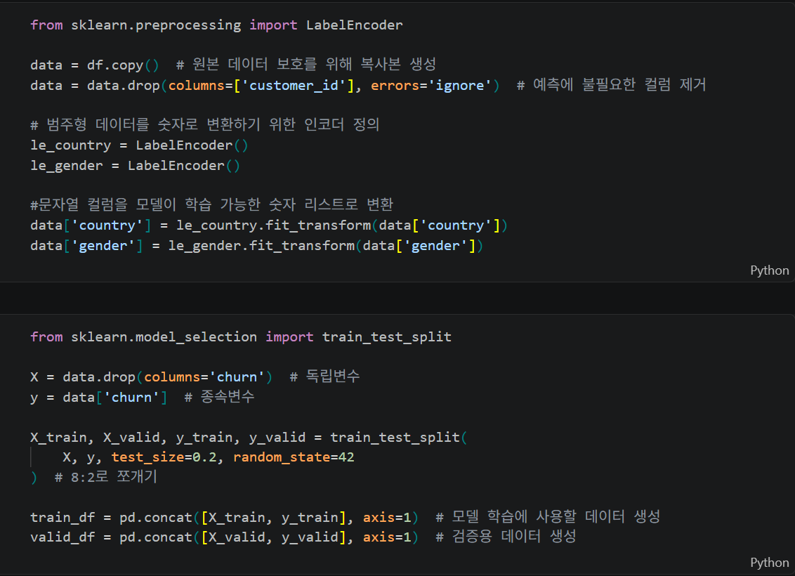
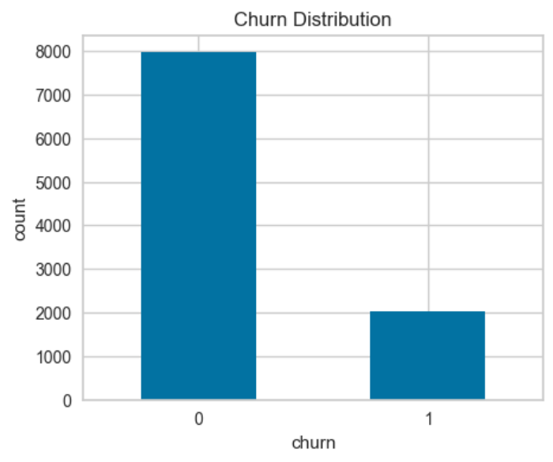
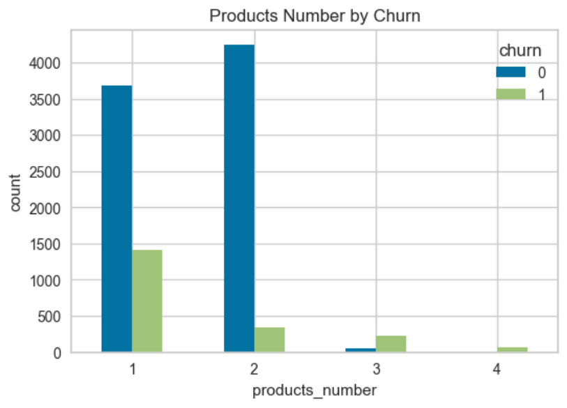
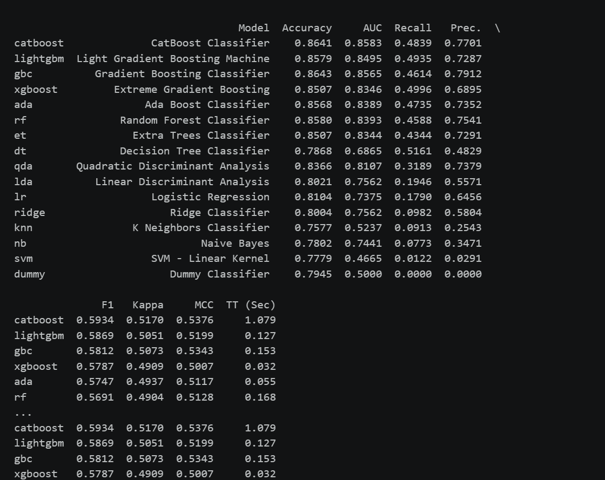
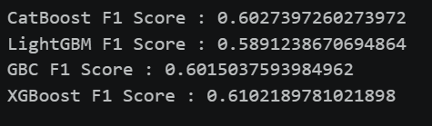
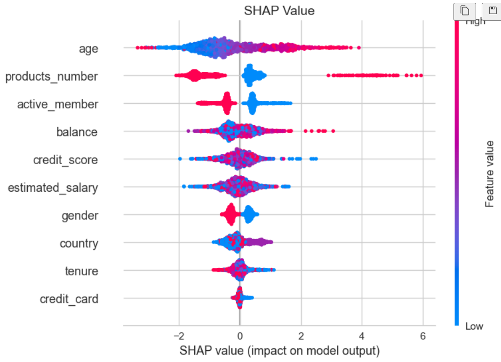
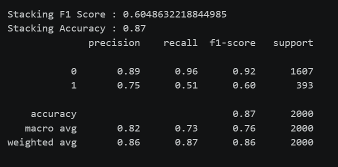

# IMBK_Bank_Customer_Churn_ML

은행 고객 이탈 예측을 주제로 진행한 머신러닝 프로젝트입니다.  
EDA를 통해 주요 변수와 이탈 패턴을 확인하고, PyCaret으로 상위 모델을 선정한 뒤 Optuna 튜닝, 사후분석, Stacking까지 수행하였습니다.

---

## 프로젝트 개요

- **프로젝트명**: 고객 이탈 예측 분류 모델링
- **주제**: Bank Customer Churn Prediction
- **목표**: 고객 이탈 여부를 예측하고, 이탈에 영향을 주는 주요 변수를 해석하는 것입니다.

---

## 사용 기술

- Python
- pandas, numpy
- matplotlib
- scikit-learn
- PyCaret
- Optuna
- XGBoost, LightGBM, CatBoost, GradientBoostingClassifier
- SHAP

---

## 데이터 전처리

- customer_id는 고객 식별용 변수이므로 예측 변수에서 제외하였습니다.
- country와 gender는 범주형 변수이므로 숫자형으로 인코딩하였습니다.
- 결측치 확인 결과 별도의 결측치 처리 과정은 필요하지 않았습니다.
---

## EDA

### 고객 이탈 분포

### 상품 수에 따른 이탈 분포

## EDA 결과

- churn=0이 churn=1보다 많아 클래스 불균형이 존재함을 확인하였습니다.
- products_number에 따라 이탈 분포 차이가 나타났습니다.
- age는 이탈 여부에 따라 분포 차이가 나타났습니다.
- active_member는 이탈 예측에 의미 있는 변수로 보였습니다.
- gender는 일부 차이가 있었지만 핵심 변수들에 비해 영향은 상대적으로 작았습니다.
---

## 모델 선정

- PyCaret으로 여러 분류 모델을 비교하고 F1 score 기준 상위 4개 모델을 선정하였습니다.
- 상위 4개 모델은 CatBoost, LightGBM, GBC, XGBoost로 확인되었습니다.

### PyCaret 결과

---

## Optuna 튜닝

- 상위 4개 모델에 대해 각각 Optuna 기반 하이퍼파라미터 최적화를 수행하였습니다.
- 튜닝 후 XGBoost가 가장 높은 F1 score를 보였습니다.

### Optuna 결과

---

## 사후 분석 

### SHAP Value 분석

- age와 products_number가 churn 예측에 가장 큰 영향을 주는 변수로 나타났습니다.
- active_member와 balance도 예측에 의미 있는 변수로 확인되었습니다.
- tenure와 credit_card는 상대적으로 영향력이 작게 나타났습니다.

---
## Stacking

### Stacking 결과

- Optuna로 튜닝한 상위 4개 모델을 결합하여 스태킹 모델을 구성하였습니다.
- Stacking F1 Score는 0.6049, Accuracy는 0.87로 나타났습니다.
- 다만 최종적으로는 XGBoost 단일 모델이 더 적절한 모델이라고 판단하였습니다.

---

## 인사이트 및 제언

- 나이가 많은 고객일수록 이탈 가능성이 높게 나타났습니다.
- 따라서 고연령 고객에게는 더 쉬운 서비스 화면이나 전담 상담 같은 맞춤형 지원이 필요합니다.
- 상품 수 역시 중요한 변수로 나타났으며, 상품을 적게 이용하는 고객은 다른 은행으로 이동할 가능성이 더 높다고 볼 수 있습니다.
- 따라서 상품 수가 적은 고객에게는 추가 상품 가입 혜택이나 묶음 상품을 제안해 거래를 넓히는 전략이 필요합니다.

---

## 파일 구성

- `머신러닝_컴페티션_BaseLine박상면.ipynb` : 전체 분석 코드
- `README.md` : 프로젝트 설명 문서
- `images/` : 결과 이미지 폴더